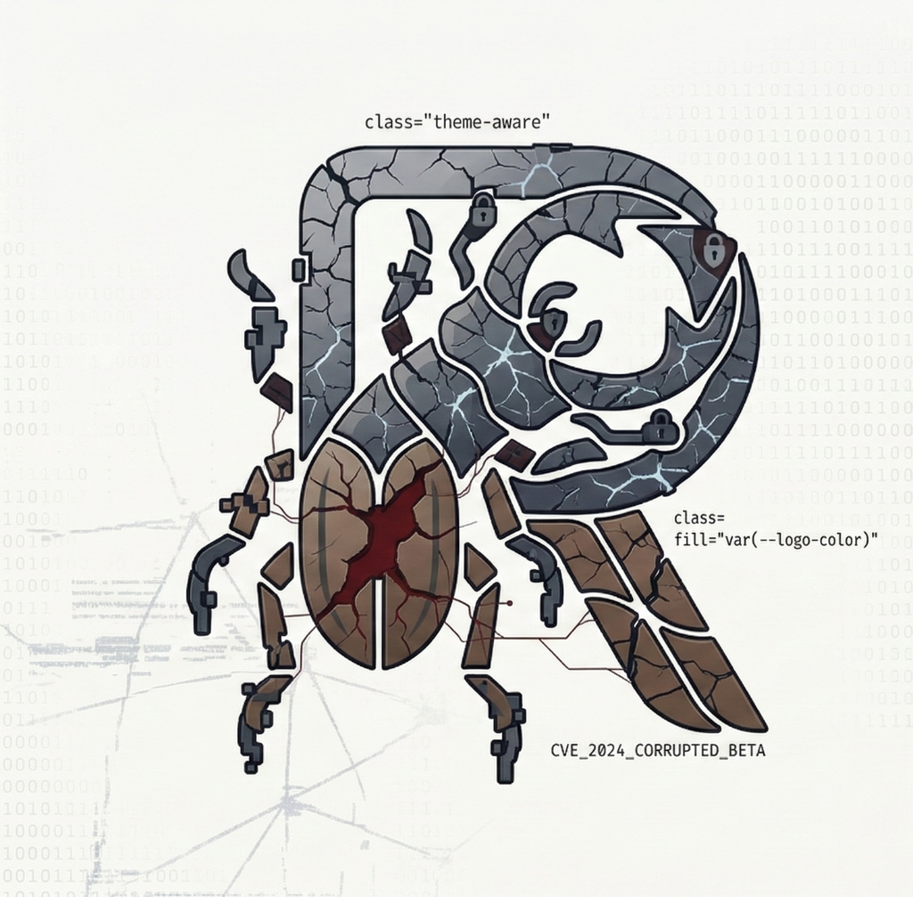

<div align="center">
  <picture>
    <source media="(prefers-color-scheme: dark)" srcset="public/logo-dark.jpg">
    <source media="(prefers-color-scheme: light)" srcset="public/logo-light.jpg">
    
  </picture>
  
  # Remediate
  <p><strong>Version:</strong> 1.5.0 (2026-03-14)</p>
  ### Direct, Serious, Zero Fluff
</div>

## Overview
Remediate is a Nessus remediation triage app built with Next.js, Prisma, PostgreSQL, and Redis. It ingests Nessus CSVs, diffs weekly uploads, tracks remediation status, and supports assignment workflows.

The platform now includes a comprehensive **Threat Intelligence Centre**. This module synchronises hourly with NVD (CVE), OSV.dev (GHSA/PyPI/etc.), and CISA KEV to provide a real-time global vulnerability feed, complete with automated daily email digests tailored to user risk preferences.

Additionally, Remediate features an isolated pentest toolkit service. The main app proxies requests to the pentest backend over an internal Docker network and enforces role-based access control for the `/tools` UI.

## Prerequisites
- Docker Desktop (for local development)

## Local Development (Docker)
1. Copy env file:
   ```bash
  # Windows (PowerShell)
  copy .env.example .env

  # macOS / Linux
  cp .env.example .env
   ```
2. Start services:
   ```bash
  docker compose up -d --build
   ```
3. Open http://localhost:3000
4. Apply Prisma schema:
  ```bash
  # Alternatively run migrations from the host
  npx prisma migrate dev

  # Or inside a container (Windows example)
  docker run --rm -v "%cd%:/app" -w /app node:lts-slim npm run db:push
  ```
5. Optional seed data:
  ```bash
  docker run --rm -v "%cd%:/app" -w /app node:lts-slim npm run db:seed
  ```

## Seed Data
Seed an admin user and a sample site:
```bash
docker run --rm -v "%cd%:/app" -w /app node:lts-slim npm run db:seed
```

## Prisma
- Generate client:
  ```bash
  docker run --rm -v "%cd%:/app" -w /app node:lts-slim npm run prisma -- generate
  ```
- Apply schema to local DB:
  ```bash
  docker run --rm -v "%cd%:/app" -w /app node:lts-slim npm run db:push
  ```

## Environment Variables

### Core (All Nodes)
- `DATABASE_URL`: Postgres connection string.
- `AUTH_SECRET`: Shared secret used for encryption and JWT signing. Must be consistent across all nodes.
- `NVD_API_KEY`: (Optional) NIST NVD API Key to increase rate limits for threat intelligence sync.

### App Node (`remediate-app`)
- `REDIS_URL`: Redis connection string.
- `NEXTAUTH_URL` / `AUTH_URL`: Public URL of the application.
- `NEXTAUTH_SECRET`: Random string for session encryption.
- `ADMIN_EMAIL`: Initial admin account.
- **Local Auth**:
  - `LOCAL_AUTH_ENABLED`: Set to `true` to enable credentials-based login.
  - `LOCAL_AUTH_USER` / `LOCAL_AUTH_PASS`: Credentials for the local admin.

### Worker Node (`remediate-worker`)
- `REDIS_URL`: Redis connection string.
- `NVD_API_KEY`: (Optional) API key for authenticated NVD requests.

### Pentest Node (`remediate-pentest-backend`)
- `PENTEST_JWT_ISSUER` / `PENTEST_JWT_AUDIENCE`: Optional JWT validation overrides.

Pentest toolkit:
- PENTEST_BACKEND_URL (defaults to http://pentest-backend:8000 in Docker)

AUTH_SECRET is used to encrypt OIDC config stored in Postgres.

External DB/Redis/Storage support:
- Set `DATABASE_URL` and `REDIS_URL` to your external services.
- The app does not depend on container-local storage for either service.
- **Azure Blob Storage**: Optionally use Azure Blob Storage for persistent upload storage. Configure via the Admin dashboard or env vars:
  - `AZURE_STORAGE_CONNECTION_STRING`
  - `AZURE_STORAGE_ACCOUNT_NAME` / `AZURE_STORAGE_ACCOUNT_KEY`
  - `AZURE_STORAGE_SAS_TOKEN`
  - `AZURE_STORAGE_CONTAINER_NAME` (required for Azure)

### Redis Requirements
- **Modules**: None required.
- **Eviction Policy**: `noeviction` is strongly recommended. Redis is used for job queueing and temporary payload storage; enabling eviction may lead to silent job loss if memory limits are reached.
- **Protocol Support**: Supports `redis://` (standard) and `rediss://` (TLS). TLS certificate validation can be toggled via `REDIS_TLS_REJECT_UNAUTHORIZED`.
- **Recommended Sizing**:
  - **Small/Standard**: 1GB - 2GB (e.g., Azure Cache for Redis C0/C1). Suitable for most use cases with moderate upload sizes and concurrency.
  - **Large/Enterprise**: 4GB+ (e.g., Azure Cache for Redis C2+). Recommended if you frequently process very large Nessus CSVs (>100MB) or have high concurrent upload activity.
  - **Note**: Memory usage is driven by CSV payloads which are stored in Redis for up to 2 hours during processing.

Docker compose overrides DATABASE_URL and REDIS_URL to use the db/redis service names.

## Upload Processing
- Uploads are queued in Redis and processed by the `worker` service.
- The API stores CSV payloads in Redis temporarily (2-hour TTL) for the worker to consume.
- Failed uploads retry up to 3 times with exponential backoff before landing in a dead-letter queue.
- Admins can requeue failed uploads from /admin/dead-letter.

## Threat Intelligence & Reports
- **Live Feed**: View real-time vulnerability data from NVD, OSV, and CISA KEV in the Intelligence Centre.
- **Daily Digest**: Configure SMTP and schedule daily vulnerability summaries (08:00 AM) in /dashboard.
- **Risk Filtering**: Set minimum risk thresholds (Critical/High/etc.) to filter notification noise.
- **Intelligent Linking**: Direct access to NVD (NIST) and OSV.dev source records for verified intelligence.
- **Weekly Reports**: Schedule weekly Nessus triage summaries in /admin/reports.
- Report settings and OIDC configurations are encrypted in Postgres using AUTH_SECRET.

### NVD API Access
The Threat Intelligence Centre performs bulk requests to the NVD CVE API (especially during initial sync).
- **Unauthenticated**: 5 requests per 30 seconds.
- **Authenticated**: 50 requests per 30 seconds (Recommended).

To obtain an API key, register at the [NVD Developer Portal](https://nvd.nist.gov/developers/request-an-api-key). Once obtained, set the `NVD_API_KEY` environment variable on your worker node.

## Migrations
On container startup the `app` and `worker` entrypoints run `prisma migrate deploy` inside `scripts/migrate.js`.

Key points:
- `scripts/migrate.js` waits for the database to be reachable, then acquires a Postgres advisory lock before running `npx prisma migrate deploy`. This ensures only one instance applies migrations at a time.
- The repository also includes a guarded `scripts/optimize-db.ts` script that applie(s) optional database optimizations (indexes, views, VACUUM). The app startup command runs this after migrations when appropriate.
- A CI workflow (.github/workflows/migrations.yml) is provided to run migrations + DB optimizations as part of your deploy pipeline — recommended for production.

Recommended patterns:
- CI-driven: run `npx prisma migrate deploy` in your CI before updating production containers (strongly recommended for Azure Container Apps).
- Runtime fallback: keep `scripts/migrate.js` as a startup fallback — advisory lock prevents concurrent runs but CI-first is preferred to avoid runtime surprises.

To run migrations locally:
```bash
# Run migrations (development)
npx prisma migrate dev

# Run migrations (deploy-style)
npx prisma migrate deploy
```

## Authentication
- Keycloak OIDC is configured via .env or the Admin UI.
- If you prefer UI configuration, set the values in the Admin page and redeploy or restart to pick them up.

To create a portal tile (for example Microsoft MyApplications) that immediately starts SSO when clicked, point the tile at your app's NextAuth provider signin URL. Example:

```
https://<your-domain>/api/auth/signin/keycloak

// Optionally include a callbackUrl to return users to a specific page after sign-in:
https://<your-domain>/api/auth/signin/keycloak?callbackUrl=https%3A%2F%2F<your-domain>%2Fdashboard
```

The provider id (`keycloak` above) matches the provider added in `auth.ts`.

Alternatively, you can point portal tiles at the login page which will automatically start the Keycloak flow and is often more reliable when embedded in portals:

```
https://<your-domain>/login?sso=keycloak

// With a callback:
https://<your-domain>/login?sso=keycloak&callbackUrl=https%3A%2F%2F<your-domain>%2Fdashboard
```

## Pentest Toolkit
- The pentest backend runs in a separate container without host-exposed ports.
- Tools are defined in `pentest-backend/config/tools.json` and mounted into the backend container.
- Only users with `pentest_user`, `pentest_admin`, or `site_admin` roles can access `/tools`.
- Execution logs are stored in Postgres in the `PentestExecution` table.

Local development notes (pentest-backend):

- The pentest backend is reachable from the app via the internal Docker network at `http://pentest-backend:8000`. For local Next.js running on the host you can set `PENTEST_BACKEND_URL=http://localhost:8000` in your `.env` and expose the backend with `ports: - "8000:8000"` in `docker-compose.yml` (not the default for security).
- If the pentest backend needs to resolve public domains, the compose file now configures DNS servers for the service and attaches it to the default network to allow outbound network access. See `docker-compose.yml` for the `dns:` and `networks:` entries.
- Tools are strictly allowlisted via `pentest-backend/config/tools.json`. Review allowed flags and inputs before enabling additional tools.
- The backend requires `AUTH_SECRET` to validate signed tokens issued by the app; the app signs short-lived JWTs for proxying requests to the toolkit.

Security note:
- The pentest toolkit executes native binaries. In production, run it in an isolated environment with strict network egress controls, resource limits, and audit logging. Consider running as a separate project with dedicated secrets and monitoring.

## Deployment (Azure Container Apps)
High-level steps:
1. Build and push image to ACR (or another registry).
2. Provision Azure Database for PostgreSQL and Azure Cache for Redis.
3. Create an Azure Container Apps environment and app.
4. Configure app secrets and environment variables in ACA.
5. Enable ingress, set the container port to 3000, and deploy.

Recommended ACA settings:
- Min replicas: 0, Max replicas: 3+
- Scale on HTTP concurrency
- Use managed identities for Azure resources where possible

Migration recommendation for ACA:
- Use a CI-driven migration step or an Azure Container Apps Job to run:
  - `npx prisma migrate deploy`
  - `npx tsx scripts/optimize-db.ts`
- Keep the runtime `scripts/migrate.js` as a safe fallback — it uses an advisory lock so multiple replicas won't race.

CI example: see `.github/workflows/migrations.yml` which runs migrations and DB optimizations on push to `main`.

## Repo Structure
- app/: Next.js app router
- prisma/: Prisma schema
- Dockerfile: Multi-stage container build
- docker-compose.yml: Local dev stack (app, Postgres, Redis)

## Release notes

- **v1.5.0 — 2026-03-14**
  - Feature: Premium Intelligence Background (Command Centre topographic design).
  - Architecture: Portaled background implementation for full-viewport coverage.
  - Fix: Emergency system recovery for Docker environment and build integrity.

- **v1.4.0 — 2026-03-13**
  - Feature: Intelligent Vulnerability Linking (Dynamic NIST/OSV redirects).
  - Feature: Localisation audit (UK English "Centre" naming convention).
  - Testing: Implementation of focused unit and component tests for the Intelligence module.
  - Fix: Standardised theme-aware colors for high contrast in light and dark modes.
  - Fix: Resolved stale CVE sorting bug in the live feed.

- **v1.3.0 — 2026-03-12**
  - Feature: Relocated Threat Intelligence to a dedicated Centre page.
  - Feature: High-fidelity "Latest Intelligence" dashboard summary card.
  - Design: System-wide glassmorphism and modern scrollbar implementation.
  - Interaction: Success/error toast notifications for user interactions.

- **v1.2.0 — 2026-03-11**
  - Feature: Automated synchronisation with NVD, OSV, and CISA KEV.
  - Feature: Daily vulnerability email dispatcher with risk filtering.

- **v1.1.6 — 2026-03-10**
  - Fix: Azure Blob upload/download Node runtime bugs and unified SDK imports.
  - Fix: JWT/session role propagation improvements.
  - Health checks and worker/prisma startup enhancements.
